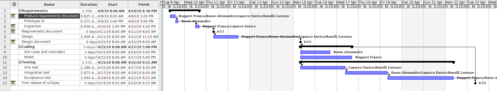

# Project Estimation  template

Authors:
* Bonelli Lorenzo 267563  
* Ruggeri Franco 265682  
* Rosso Alessandro 265485  
* Loparco Enrico 261072  

Date: 02/06/19

Version: 1.0.0

# Contents

- [Data from your LaTazza project](#data-from-your-latazza-project)
- [Estimate by product decomposition](#estimate-by-product-decomposition)
- [Estimate by activity decomposition ](#estimate-by-activity-decomposition)

# Data from your LaTazza project

###

| | |
| ----------- | ------------------------------- | 
|         Total person hours  worked by your  team, considering period March 5 to May 26, considering ALL activities (req, des, code, test,..)    | 120 ph  |             
|Total Java LoC delivered on May 26 (only code, without Exceptions, no Junit code) | 700 LOC |
| Total number of Java classes delivered on May 26 (only code, no Junit code, no Exception classes)| 8 classes |
| Productivity P =| 700/120 = 5.8 LOC/ph |
|Average size of Java class A = | 700/8 = 87.5 LOC/class |

# Estimate by product decomposition

### 

|             | Estimate                        |             
| ----------- | ------------------------------- |  
| Estimated n classes NC (no Exception classes)  |                6  classes           |             
| Estimated LOC per class  (Here use Average A computed above )      |            87.5 LOC/class                | 
| Estimated LOC (= NC * A) | 525 LOC |
| Estimated effort  (person days) (Here use productivity P)  | 525/(5.8\*8)= 11.3 person days                                    |      
| Estimated calendar time (calendar weeks) (Assume team of 4 people, 8 hours per day, 5 days per week ) |       11.3*8/(4\*8\*5) = 0.6 weeks           |               

# Estimate by activity decomposition

### 

|         Activity name    | Estimated effort    |             
| ----------- | ------------------------------- | 
| Requirements | 30 ph |
| Design | 15 ph |
| Coding | 10 ph |
| Unit testing | 10 ph |
| Integration testing | 15 ph |
| Acceptance testing | 10 ph |

### Gantt chart

