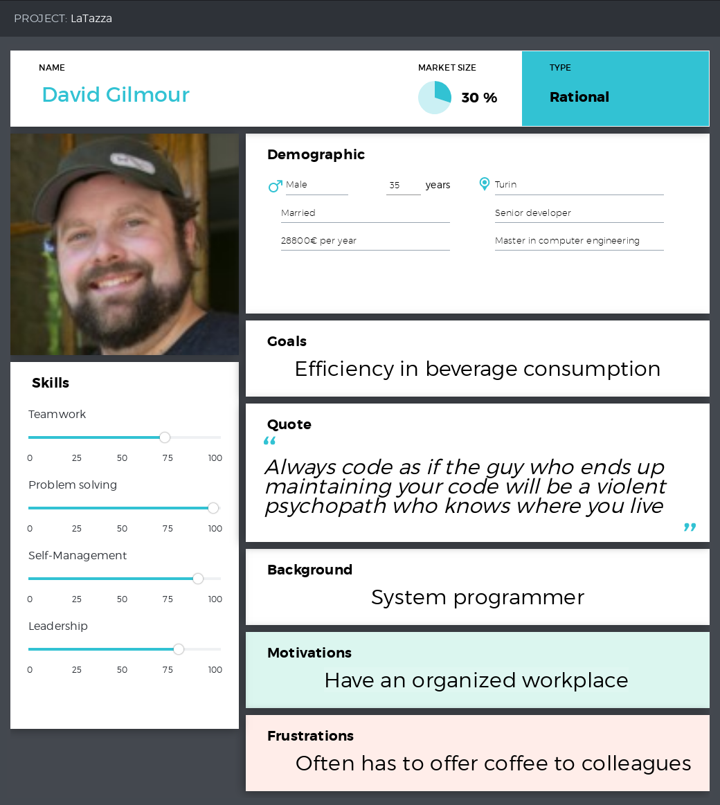
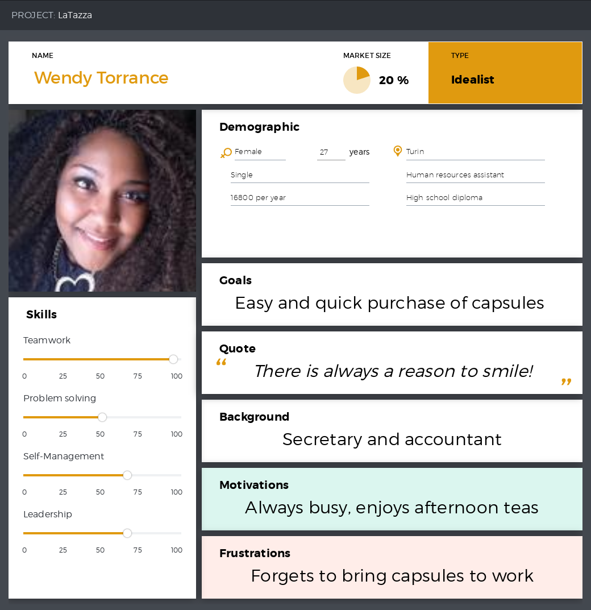
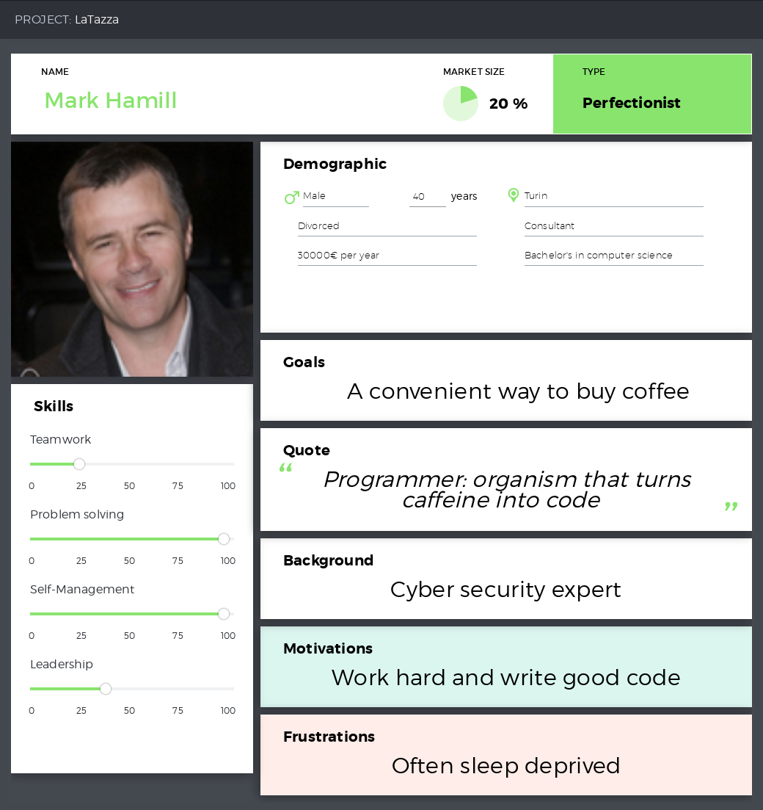
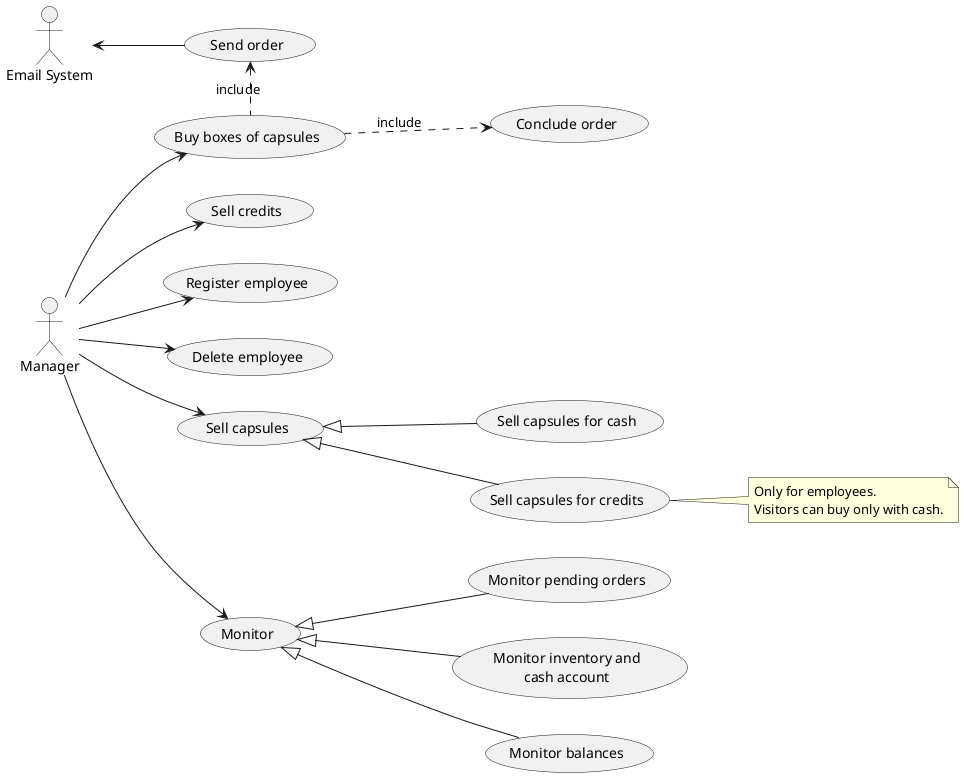

# Requirements Document

Authors:  
* Bonelli Lorenzo       267563  
* Ruggeri Franco        265682  
* Rosso Alessandro      265485  
* Loparco Enrico        261072  
  
Date: 10/04/19
  
Version: 1.0.0

# Contents

- [Abstract](#abstract)
- [Stakeholders](#stakeholders)
- [Context Diagram and interfaces](#context-diagram-and-interfaces)
  + [Context Diagram](#context-diagram)
  + [Interfaces](#interfaces) 
- [Stories and personas](#stories-and-personas)
- [Functional and non functional requirements](#functional-and-non-functional-requirements)
  + [Functional Requirements](#functional-requirements)
  + [Non functional requirements](#non-functional-requirements)
- [Use case diagram and use cases](#use-case-diagram-and-use-cases)
  + [Use case diagram](#use-case-diagram)
  + [Use cases](#use-cases)
  + [Relevant scenarios](#relevant-scenarios)
- [Glossary](#glossary)
- [System design](#system-design)

# Abstract

LaTazza is a simple desktop application adopted by a group of office workers to satisfy the necessity of capsules in the workplace.

One employee takes the role of manager, he acts as a seller handling the supply and the resale of capsules while turning a small profit.  
As soon as an order is placed, an email is sent to the capsule supplier who ships the boxes. The order is agreed to be paid in cash upon delivery.

# Stakeholders

| Stakeholder name  	| Description 							    | 
|-----------------------|-------------------------------------------|
| Manager    			| Manage the purchase and sale of capsules	| 
| Employee  			| Buy capsules from manager 			    |
| Visitor        		| Buy capsules from manager      			|
| Capsule Vendor        | Sell capsules to manager 				    |


# Context Diagram and interfaces

## Context Diagram

```plantuml
left to right direction
skinparam packageStyle rectangle

actor Manager as m
actor "Email System" as es

rectangle system {
    (LaTazza) as lt
    m -- lt
    lt -- es
}
```

## Interfaces

| Actor                         | Logical Interface	            | Physical Interface    |
|-------------------------------|-------------------------------|:---------------------:|
| Manager      			        | GUI			                | Screen, keyboard		|
| Email System                  | Web service, POP, IMAP, SMTP  | Internet connection	|


# Stories and personas

## Persona 1
  
*LaTazza manager*
## Persona 2 \*
  
*LaTazza employee*
## Persona 3 \*
  
*LaTazza visitor*

_\*=Wendy and Mark aren't proper personas (because they are no actors). However they add useful informations since they are clients and this project was specifically created for them._

## Story 1
David, LaTazza manager, notices the inventory is running low on capsules.

He sends an order to the supplier for two boxes of coffee and one of lemon tea. 
He doesn't want to waste too much time. He runs LaTazza and easily completes the order.

After two days the order is shipped to the company, he pays the supplier and then confirms the reception on LaTazza.

## Story 2
It's Tuesday 16:47.

Wendy takes a break to have an afternoon tea. She wants to buy 4 capsules for the rest of the week.
She doesn't want to wait long to complete the transaction and she doesn't have coins, only banknotes.

Since her balance is negative, she pays 20€ to add credit on her account and then she completes the purchase.

She proceeds to the hall to drink her tea and chat with other employees.

## Story 3
It's Thursday morning.

Mark is a temporary guest in this company. He was called as a consultant to review and improve the security system.

He is tired because last night he worked on a project until late, he wants to buy coffee at a convenient price.

He asks to buy in cash, he receives a coffee capsule quickly and he goes to the coffee maker right after.


# Functional and non functional requirements

## Functional Requirements
| ID    | Description  |
|:-----:| ------------ |
| FR1   | The manager shall be able to create an account for a non-registered employee |
| FR2   | The manager shall be able to delete an account for a registered employee |
| FR3   | The manager shall be able to sell capsules for credits to a registered employee |
| FR4   | The manager shall be able to sell capsules for cash to an employee or a visitor |
| FR5   | The manager shall be able to order boxes of capsules |
| FR6   | The manager shall be able to confirm the receiption of a pending order |
| FR7   | The manager shall be able to delete a canceled order |
| FR8   | The manager shall be able to sell credits to a registered employee |
| FR9   | The manager shall be able to monitor the balances of the employees |
| FR10   | The manager shall be able to monitor inventory and cash account |
| FR11  | The manager shall be able to monitor pending orders |

## Non Functional Requirements
| ID   | Type        | Description  | Refers to |
|:----:|:-----------:| ------------ |:---------:|
| NFR1 | Efficiency  | Operations should be completed in less than 0.1 sec | all FRs |
| NFR2 | Efficiency  | The application should use at most 1 Mbyte of RAM | all FRs |
| NFR3 | Reliability | The application should crash at most 1 time each month | all FRs |
| NFR4 | Portability | The application should be runnable on the most common operating systems (Windows, Linux, Mac) | all FRs |
| NFR5 | Usability   | The manager should be able to use the application with less than 10 minutes of training | all FRs |
| NFR6 | Robustness  | Probability of data corruption on failure should be less than 1% | all FRs |
| NFR7 | Domain      | Currency is € | FR4, FR5, FR8, FR9, FR10 |


# Use case diagram and use cases

## Use case diagram


## Use Cases

### Register employee
| Actors involved  | Manager |
|:----------------:| ------- |
| Precondition     | Employee works in the company |
| Post condition   | Employee has an account |
| Nominal scenario | Successful registration of new employee |
| Variants         | Registration refused (reasons: employee already registered, not valid ID (wrong format)) |

### Delete employee
| Actors involved  | Manager |
|:----------------:| ------- |
| Precondition     | Employee works in the company |
| Post condition   | Employee does not have an account |
| Nominal scenario | Successful deletion of employee |
| Variants         | Manager does not find employee (reason: employee not registered) |

### Sell capsules for credits
| Actors involved  | Manager |
|:----------------:| ------- |
| Precondition     | Employee works in the company |
| Post condition   | - (it depends on the scenario) |
| Nominal scenario | Successful sale of capsules for credits (credits and number of capsules in inventory decreased) |
| Variants         | Manager does not find employee (reason: employee not registered), Sale refused (reasons: not enough capsules in inventory, not valid quantity (e.g. negative number)) |

### Sell capsules for cash
| Actors involved  | Manager |
|:----------------:| ------- |
| Precondition     | - (it depends on the scenario) |
| Post condition   | - (it depends on the scenario) |
| Nominal scenario | Successful sale of capsules for cash (cash account increase and number of capsules in inventory decreased) |
| Variants         | Sale refused (reasons: not enough capsules in inventory, not valid quantity (e.g. negative number)) |

### Send order
| Actors involved  | Manager, Capsule Vendor |
|:----------------:| ---------------------- |
| Precondition     | - (it depends on the scenario) |
| Post condition   | - (it depends on the scenario) |
| Nominal scenario | Successful sending of order (order stored as pending and email sent) |
| Variants         | Order refused and email not sent (reason: not enough money in cash account, not valid quantities (e.g. negative numbers)) |

### Conclude order
| Actors involved  | Manager |
|:----------------:| ------- |
| Precondition     | Order has been sent and is pending |
| Post condition   | Order removed from the list of pending orders |
| Nominal scenario | Successful reception of order (inventory updated) |
| Variants         | Order canceled by manager (involving cash account increased due to refund; reason: order canceled by vendor) |

### Sell credits
| Actors involved  | Manager |
|:----------------:| ------- |
| Precondition     | employee has an account |
| Post condition   | - (it depends on the scenario) |
| Nominal scenario | Successful sale of credits to employee |
| Variants         | Sale refused (reasons: not valid number of credits to sell (e.g. negative number)) |

### Monitor
| Actors involved  | Manager |
|:----------------:| ------- |
| Precondition     | - |
| Post condition   | Data are shown |
| Nominal scenario | Correct visualization of data |
| Variants         | - |

# Relevant scenarios
### Successful registration of a new employee
Precondition: employee works in the company and has not been registered yet  
Post condition: employee has an account

| Scenario ID: SC1 | Corresponds to UC: Register employee |
|:----------------:| ------------------------------------ |
| Step #           | Description                          |
| 1                | Manager clicks on 'Employees' |
| 2                | System shows the form for adding details about employee (ID, name, surname) |
| 3                | Manager compiles the form and clicks 'Register' |
| 4                | System creates a new account for the employee with balance 0 |

### Successful sale of capsules for credits (to an employee)
Precondition: employee has an account and there are enough capsules in inventory of the desired beverage  
Post condition: employee has bought the capsules, balance of the employee and inventory are updated (decreased)

| Scenario ID: SC2 | Corresponds to UC: Sell capsules for credits |
|:----------------:| -------------------------------------------- |
| Step #           | Description                                  |
| 1                | Manager clicks on 'Sell Capsules' |
| 2                | Manager checks the checkbox 'Pay With Credits', sets 'Employee', 'Capsule Type' and 'Quantity' and finally clicks 'Sell' |
| 3                | System checks availability of capsules in inventory |
| 4                | System decreases number of capsules in inventory and credits of employee |

### Successful sale of capsules for cash to a visitor
Precondition: visitor has enough cash and there are enough capsules in inventory of the desired beverage  
Post condition: visitor has bought the capsules, cash account and inventory are updated

| Scenario ID: SC3 | Corresponds to UC: Sell capsules for cash |
|:----------------:| ----------------------------------------- |
| Step #           | Description                               |
| 1                | Manager clicks on 'Sell Capsules' |
| 2                | Manager do not check the 'Pay With Credits' checkbox, sets 'Capsule Type' and 'Quantity' and finally clicks 'Sell' |
| 3                | System checks availability of capsules in inventory |
| 4                | System decreases number of capsules in inventory and increases cash account |

### Successful sale of credits to an employee
Precondition: employee has an account  
Post condition: balance of the employee and cash account are updated (increased)

| Scenario ID: SC4 | Corresponds to UC: Sell credits |
|:----------------:| ------------------------------- |
| Step #           | Description |
| 1                | Manager clicks on 'Employees'  |
| 2                | Manager sets 'Employee' and 'Credits to sell' and clicks 'Sell' |
| 3                | System increases credits of employee and cash account |

### Successful sending of an order
Precondition: there is enough money in the cash account  
Post condition: cash account is decreases and order is stored as pending

| Scenario ID: SC5 | Corresponds to UC: Send order |
|:----------------:| ----------------------------- |
| Step #           | Description                   |
| 1                | Manager clicks on 'Orders' |
| 2                | Manager sets for each beverage the number of boxes he wants to buy and clicks 'Buy' |
| 3                | System checks cash account |
| 4                | System decreases cash account |
| 5                | System stores the order as pending |
| 6                | System notifies the vendor (email) |

### Successful reception of an order
Precondition: there is at least a pending order  
Post condition: list of pending orders and inventory are updated  

| Scenario ID: SC6 | Corresponds to UC: Conclude order |
|:----------------:| ----------------------------- |
| Step #           | Description                   |
| 1                | Manager clicks on 'Orders' |
| 2                | Manager checks for each received order the corresponding checkbox from the pending order table |
| 3                | Manager clicks on 'Confirm Selected' |
| 4                | System sets selected orders as received (orders disappear from the pending order table) |
| 5                | System increases number of capsules in inventory |

### Unsuccessful sale of capsules for credits for unavailability in inventory
Precondition: employee has an account  
Post condition: N/A

| Scenario ID: SC7 | Corresponds to UC: Sell capsules for credits |
|:----------------:| -------------------------------------------- |
| Step #           | Description                                  |
| 1                | Manager clicks on 'Sell Capsules' |
| 2                | Manager checks the checkbox 'Pay With Credits', sets 'Employee', 'Capsule Type' and 'Quantity' and finally clicks 'Sell' |
| 3                | System checks availability of capsules in inventory |
| 4                | System shows error message 'Not enough capsules in inventory' |

### Unsuccessful sending of an order for unavailability in cash account
Precondition: -  
Post condition: N/A

| Scenario ID: SC8 | Corresponds to UC: Send order |
|:----------------:| ----------------------------- |
| Step #           | Description                   |
| 1                | Manager clicks on 'Orders' |
| 2                | Manager sets for each beverage the number of boxes he wants to buy and clicks 'Buy' |
| 3                | System checks cash account |
| 4                | System shows error message 'Not enough money in cash account' |

# Glossary

```plantuml
class Manager {
	+cashAccount
}
class Box {
	+barcode
	+type
	+price
}
class Capsule {
	+type
	+sellPrice
}
class Customer {
	+name
}
class Visitor {

}
class Employee {
	+ID
	+balance
}

class Order {
    +date
    +state
}

Customer <|-- Employee
Customer <|-- Visitor
Employee <|-- Manager
Manager "1" -- "*" Order : makes >
Order "1" -- "1..*" Box : contains >
Box "1" o-- "50" Capsule : contains > 
Customer "1" -- "*" Capsule : buys >
Manager "1" -- "*" Employee : adds credit >

note "sellPrice includes profit percentage" as N1
note "price is the payment to vendor, without profit percentage" as N2
note left of Order: state: pending or received
Capsule .. N1
N2 .. Box

```


# System Design
```plantuml
class LaTazzaSystem {
}

class Computer {
  +registerEmployee()
  +removeEmployee()
  +showEmployees()
  +sellCapsulesWithCredits()
  +sellCapsulesWithCash()
  +sellCredits()
  +showInventory()
  +showPendingOrders()
  +sendOrderViaEmail()
  +confirmOrderReception()
  +cancelOrder()
}

class EmailGateway {
  +sendOrderViaEmail()
}

LaTazzaSystem o-- Computer

Computer -- EmailGateway
```
