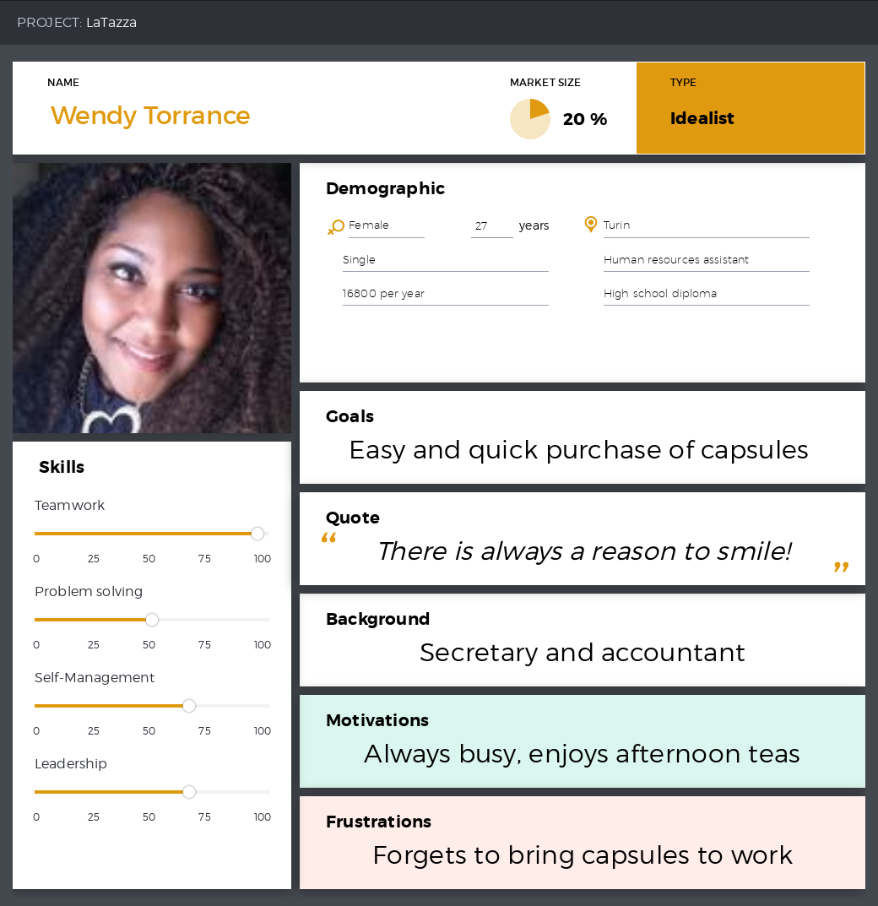

# Requirements Document

Authors: 

Date:

Version:

# Contents

- [Abstract](#abstract)
- [Stakeholders](#stakeholders)
- [Context Diagram and interfaces](#context-diagram-and-interfaces)
  + [Context Diagram](#context-diagram)
  + [Interfaces](#interfaces) 
- [Stories and personas](#stories-and-personas)
- [Functional and non functional requirements](#functional-and-non-functional-requirements)
  + [Functional Requirements](#functional-requirements)
  + [Non functional requirements](#non-functional-requirements)
- [Use case diagram and use cases](#use-case-diagram-and-use-cases)
  + [Use case diagram](#use-case-diagram)
  + [Use cases](#use-cases)
  + [Relevant scenarios](#relevant-scenarios)
- [Glossary](#glossary)
- [System design](#system-design)

# Abstract

LaTazza is a simple desktop application adopted by a group of office workers to satisfy the necessity of coffee capsules in the workplace.

One employee takes the role of manager, he acts as a seller handling the supply and the resale of capsules while turning a small profit.

# Stakeholders

| Stakeholder name  	| Description 							    | 
|-----------------------|-------------------------------------------|
| Manager    			| Manage the purchase and sale of capsules	| 
| Employee  			| Buy capsules from manager 			    |
| Visitor        		| Buy capsules from manager      			|
| Coffee Capsule Vendor | Sell capsules to manager 				    |

# Context Diagram and interfaces

## Context Diagram

```plantuml
left to right direction
skinparam packageStyle rectangle

actor Manager as m
actor "Coffe Capsule Vendor" as v

rectangle system {
    (LaTazza) as lt
    m -- lt
    lt -- v
}
```

## Interfaces

| Actor                         | Logical Interface	| Physical Interface    |
|-------------------------------|:-----------------:|:---------------------:|
| Manager      			        | GUI			    | Screen, keyboard		|
| Coffee Capsule Vendor         | Web service, APIs	| Internet connection	|

The banking/credit card system is not listed in the actors because, even if the application makes the orders automatically once the manager choose to buy new boxes of capsules from the GUI, the payment to the vendor is handled separately (by the manager, not the application). 

# Stories and personas

## Persona 1

*LaTazza client*
## Persona 2

*LaTazza manager*
## Persona 3

*LaTazza client*

## Story 1
David, LaTazza manger notices the inventory is are running low on capsules.

He sends an order to the supplier for two boxes of coffee and one of lemon tea. 
He doesn't want to waste too much time. He runs LaTazza and easily completes the order.

After two days the order is shipped to the company, he pays the supplier and then confirms the reception on LaTazza.

## Story 2
It's Tuesday 16:47.

Wendy takes a break to have an afternoon tea. She wants to buy 4 capsules for the rest of the week.
She doesn't want to wait long to complete the transaction and she doesn't have coins.

Since her balance is negative, she pays 10€ to add credit on her account and then she completes the purchase.

She proceeds to the hall to drink her tea and chat with other employees.

## Story 3
It's Thursday morning.

Mark is a temporary guest in this company. He was called as a consultant to review and improve the security system. 

He is tired because last night he worked on a project until late, he wants to buy coffee at a convenient price.

He asks to buy in cash, he recieves a coffee capsule quickly and he goes to the coffee maker right after.

# Functional and non functional requirements

## Functional Requirements

| ID   | Description  |
|:----:| ------------ |
| F1   | Register employee |
| F2   | Sell capsules (for credits or cash) |
| F3   | Buy boxes of capsules |
| F3.1 | Send order |
| F3.2 | Confirm reception of order |
| F4   | Sell credits |
| F5   | Show inventory and cash account |
| F6   | Show pending orders |

## Non Functional Requirements

# Use case diagram and use cases

## Use case diagram

## Use Cases

# Relevant scenarios

# Glossary

```plantuml
class Manager {
	+cashAccount
}
class Box {
	+barcode
	+type
	+price
}
class Capsule {
	+type
	+sellPrice
}
class User {
	+name
}
class Visitor {

}
class Employee {
	+ID
	+name
	+balance
}

User <|-- Employee
User <|-- Visitor
Employee <|-- Manager
Manager "1" -- "*" Box : orders >
Box "1" -- "50" Capsule : contains > 
User "1" -- "*" Capsule : buys >
Manager "1" -- "*" Employee : adds credit >

note "sellPrice includes profit percentage" as N1
note "price is the payment to vendor, without profit percentage" as N2
Capsule .. N1
N2 .. Box
```

# System Design
