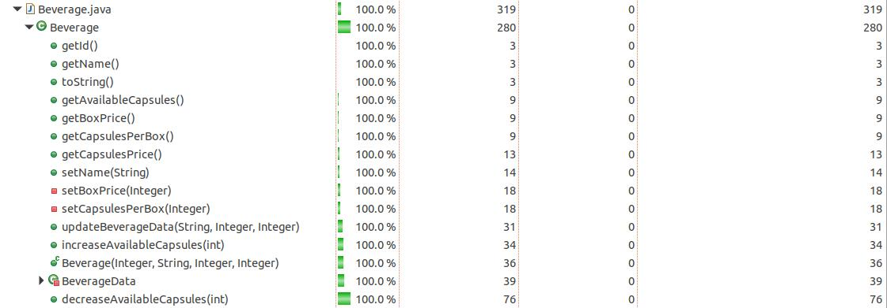
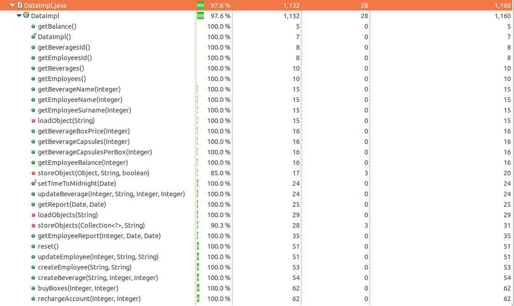

# Unit Testing Documentation template

Authors:
* Bonelli Lorenzo 267563  
* Ruggeri Franco 265682  
* Rosso Alessandro 265485  
* Loparco Enrico 261072  

Date: 19/05/19

Version: 1.0.0

# Contents

- [Black Box Unit Tests](#black-box-unit-tests)

- [White Box Unit Tests](#white-box-unit-tests)

# Black Box Unit Tests

*Note*: the pruning in the combination of predicates is represented with ~~strikethrough rows~~.

### Class Employee

**Criteria for method *increaseBalance*:**
 - Sign of amount
 - Overflow of balance

**Predicates for method *increaseBalance*:**

| Criteria | Predicate |
| -------- | --------- |
| Sign of amount | >= 0 |
|            | < 0 |
| Overflow of balance | balance + amount  > MAXINT |
|            | balance + amount <= MAXINT |

**Boundaries for method *increaseBalance*:**

| Criteria | Boundary values |
| -------- | --------------- |
|   Sign of amount       |    MININT, 0, MAXINT             |
|     Overflow of balance      |     balance + amount = MAXINT      |   

**Combination of predicates for method *increaseBalance*:**

| Sign of amount | Overflow of balance | Valid / Invalid | Description of the test case | JUnit test case |
|-------|-------|-------|-------|-------|
| >= 0 | no | V | increaseBalance(10) getBalance() -> 10 | it.polito.latazza.data.TestEmployee.testIncreaseBalance1 |
|  | yes | I | increaseBalance(10) increaseBalance(MAXINT) -> EmployeeException | it.polito.latazza.data.TestEmployee.testIncreaseBalance2 |
| < 0 | no | I | increaseBalance(-10) -> EmployeeException | it.polito.latazza.data.TestEmployee.testIncreaseBalance3 |
|  | ~~yes~~ | ~~I~~ | |  |

**Criteria for method *decreaseBalance*:**
 - Sign of amount
 - Overflow of balance

**Predicates for method *decreaseBalance*:**

| Criteria | Predicate |
| -------- | --------- |
| Sign of amount |      >= 0     |
|          |     < 0      |
| Overflow of balance | balance - amount < MININT |
|   | balance - amount >= MININT |

**Boundaries for method *decreaseBalance*:**

| Criteria | Boundary values |
| -------- | --------------- |
|   Sign of amount   |    MININT, 0, MAXINT             |
|     Overflow of balance      |     balance - amount = MININT      |   

**Combination of predicates for method *decreaseBalance*:**

| Sign of amount | Overflow of balance |  Valid / Invalid | Description of the test case | JUnit test case |
|-------|-------|-------|-------|-------|
| >= 0 | no | V | decreaseBalance(10) getBalance() -> -10 | it.polito.latazza.data.TestEmployee.testDecreaseBalance1 |
| | yes | I | decreaseBalance(10) decreaseBalance(MAXINT) -> EmployeeException |  it.polito.latazza.data.TestEmployee.testDecreaseBalance2 |
| < 0 | no | I | decreaseBalance(-10) -> EmployeeException | it.polito.latazza.data.TestEmployee.testDecreaseBalance3 |
| | ~~yes~~ | ~~I~~ |  |  |

### Class Beverage

**Criteria for method increaseAvailableCapsules:**
 - Sign of numberOfBoxes
 - Overflow of availableCapsules

**Predicates for method increaseAvailableCapsules:**

| Criteria | Predicate |
| -------- | --------- |
| Sign of numberOfBoxes |      >= 0     |
|          |     < 0      |
|    Overflow of availableCapsules      |     availableCapsules + numberOfBoxes * capsulesPerBox > MAXINT      |
|          |    availableCapsules + numberOfBoxes * capsulesPerBox <= MAXINT        |

**Boundaries for method increaseAvailableCapsules:**

| Criteria | Boundary values |
| -------- | --------------- |
|   Sign of numberOfBoxes       |    MININT, 0, MAXINT             |
|     Overflow of availableCapsules      |     availableCapsules + numberOfBoxes * capsulesPerBox = MAXINT      |   

**Combination of predicates for method increaseAvailableCapsules:**

| Sign of numberOfBoxes | Overflow of availableCapsules | Valid / Invalid | Description of the test case | JUnit test case |
|-------|-------|-------|-------|-------|
| >= 0 | no | V | Beverage b = new Beverage(1, "Coffee", 500, 20);  b.increaseAvailableCapsules(2);  *boundary:* Beverage b = new Beverage(1, "Coffee", 5000, Integer.MAX_VALUE);  b.increaseAvailableCapsules(1);| it.polito.latazza.data.TestBeverage.tc1    it.polito.latazza.data.TestBeverage.tc8 |
|  | yes | I | Beverage b = new Beverage(1, "Coffee", 500, 20); b.increaseAvailableCapsules(10); b.increaseAvailableCapsules((Integer.MAX_VALUE - 100) / 20); -> BeverageException| it.polito.latazza.data.TestBeverage.tc2 |
| < 0 | no | I |Beverage b = new Beverage(1, "Coffee", 500, 20); b.increaseAvailableCapsules(-10); -> BeverageException| it.polito.latazza.data.TestBeverage.tc3 |
|  | yes | / ||  |

**Criteria for method decreaseAvailableCapsules:**
 - Sign of numberOfCapsules
 - Enough availableCapsules

**Predicates for method decreaseAvailableCapsules:**

| Criteria | Predicate |
| -------- | --------- |
| Sign of numberOfCapsules |      >= 0     |
|          |     < 0      |
| Enough availableCapsules | availableCapsules >= numberOfCapsules |
|   | availableCapsules < numberOfCapsules |

**Boundaries for method decreaseAvailableCapsules:**:

| Criteria | Boundary values |
| -------- | --------------- |
|   Sign of numberOfCapsules   |    MININT, 0, MAXINT             |
|     Overflow of availableCapsules      |     availableCapsules + numberOfBoxes * capsulesPerBox = MAXINT      |   

**Combination of predicates for method decreaseAvailableCapsules:**:

| Sign of numberOfCapsules | Enough availableCapsules | Overflow of availableCapsules | Valid / Invalid | Description of the test case | JUnit test case |
|-------|-------|-------|-------|-------|-------|
| >= 0 | yes | no | V | Beverage b = new Beverage(1, "Coffee", 500, 20); b.increaseAvailableCapsules(2); b.decreaseAvailableCapsules(10);| it.polito.latazza.data.TestBeverage.tc4 |
| |  | yes | / || |
| | no | no | I |Beverage b = new Beverage(1, "Coffee", 500, 20); b.increaseAvailableCapsules(2); b.decreaseAvailableCapsules(50); -> NotEnoughCapsules| it.polito.latazza.data.TestBeverage.tc5 |
| | | yes | / || |
| < 0 | yes | no | I | Beverage b = new Beverage(1, "Coffee", 500, 20); b.increaseAvailableCapsules(2); b.decreaseAvailableCapsules(-5); -> BeverageException| it.polito.latazza.data.TestBeverage.tc6 |
| | | yes | I | Beverage b = new Beverage(1, "Coffee", 500, 20); b.increaseAvailableCapsules(2); b.decreaseAvailableCapsules(- (Integer.MAX_VALUE - 20)); -> BeverageException| it.polito.latazza.data.TestBeverage.tc7 |
| | no | no | / |
| | | yes | / |

### Class Consumption

**Criteria for constructor 1:**
 - Valid beverage
 - Valid employee
 - Sign of numberOfCapsules

**Predicates for method constructor 1:**

| Criteria            | Predicate                  |
| ------------------- | -------------------------- |
| Valid beverage  | yes |
|                    | no  |
| Valid employee  | yes |
|                    | no  |
| Sign of numberOfCapsules  | >= 0 |
|                    | < 0  |

**Boundaries**:

| Criteria       | Boundary values   |
| -------------- | ----------------- |
| Sign of numberOfCapsules | MININT, 0, MAXINT |

**Combination of predicates**:

| Valid beverage | Valid employee | Sign of boxQuantity| Valid / Invalid | Description of the test case | JUnit test case                         |
| -------------- | --------------- | --------------- | ---------------------------- | --------------------------------------- | ---|
| yes     | yes     |>= 0    |V               |Beverage b = new Beverage(1, "tea", 10, 10); Employee e = new Employee(1,"John", "Doe"); new Consumption(b, e, true, 10); new Consumption(e, b, false, 10); | it.polito.latazza.data.Consumption.tc1 |
|      |      |< 0    |I               |Beverage b = new Beverage(1, "tea", 10, 10); Employee e = new Employee(1,"John", "Doe"); new Consumption(b, e, true, -10); new Consumption(e, b, false, -10); | it.polito.latazza.data.Consumption.tc2 |
| no    | yes    |     |I              | Employee e = new Employee(1,"John", "Doe"); new Consumption(e, null, true, 10); new Consumption(e, null, false, 10); | it.polito.latazza.data.Consumption.tc3 |
| yes     | no     |     |I               |Beverage b = new Beverage(1, "tea", 10, 10); new Consumption(null, b, true, 10); new Consumption(null, b, false, 10); | it.polito.latazza.data.Consumption.tc4 |

**Criteria for constructor 2:**
 - Valid beverage
 - Sign of numberOfCapsules

**Predicates for method constructor 2:**

| Criteria            | Predicate                  |
| ------------------- | -------------------------- |
| Valid beverage  | yes |
|                    | no  |
| Sign of numberOfCapsules  | >= 0 |
|                    | < 0  |

**Boundaries**:

| Criteria       | Boundary values   |
| -------------- | ----------------- |
| Sign of numberOfCapsules | MININT, 0, MAXINT |

**Combination of predicates**:

| Valid beverage | Sign of boxQuantity| Valid / Invalid | Description of the test case | JUnit test case                         |
| -------------- | --------------- | ---------------------------- | --------------------------------------- | ---|
| yes     |>= 0    |V               |Beverage b = new Beverage(1, "tea", 10, 10); new Consumption(b, 10); | it.polito.latazza.data.Consumption.tc5 |
| yes     |< 0    |I               |Beverage b = new Beverage(1, "tea", 10, 10); new Consumption(b, -10); | it.polito.latazza.data.Consumption.tc6 |
| no     |     |I               | new Consumption(null, 10); | it.polito.latazza.data.Consumption.tc7 |

### Class BoxPurchase

**Criteria for constructor:**

- Valid beverage
- Sign of boxQuantity

**Predicates for method constructor:**

| Criteria            | Predicate                  |
| ------------------- | -------------------------- |
| Valid beverage  | yes |
|                    | no  |
| Sign of boxQuantity  | >= 0 |
|                    | < 0  |

**Boundaries**:

| Criteria       | Boundary values   |
| -------------- | ----------------- |
| Sign of boxQuantity | MININT, 0, MAXINT |

**Combination of predicates**:

| Valid beverage | Sign of boxQuantity| Valid / Invalid | Description of the test case | JUnit test case                         |
| -------------- | --------------- | ---------------------------- | --------------------------------------- | ---|
| yes     |>= 0    |V               |Beverage b = new Beverage(1, "tea", 10, 10); new BoxPurchase(b, 10); | it.polito.latazza.data.BoxPurchase.tc1 |
|     |< 0            | I               | Beverage b = new Beverage(1, "tea", 10, 10); new BoxPurchase(b, -1);  | it.polito.latazza.data.BoxPurchase.tc2 |
| no    |>= 0    |I              |new boxPurchase(null, 10);        | it.polito.latazza.data.BoxPurchase.tc3 |
|     |< 0            | I               | |

### Class LaTazzaAccount

**Criteria for increaseBalance:**

- Sign of amount
- Overflow of balance

**Predicates for method increaseBalance:**

| Criteria            | Predicate                  |
| ------------------- | -------------------------- |
| Sign of amount  | amount >= 0 |
|                    | amount  < 0  |
| Overflow of balance  | balance + amount > MAXINT |
|                    | amount  <= MAXINT  |

**Boundaries**:

| Criteria       | Boundary values   |
| -------------- | ----------------- |
| Sign of amount | MININT, 0, MAXINT |

**Combination of predicates**:

| Sign of amount | Overflow of balance| Valid / Invalid | Description of the test case | JUnit test case                         |
| -------------- | --------------- | ---------------------------- | --------------------------------------- | ---|
| >= 0      |no    |V               | increaseBalance(10)          | it.polito.latazza.data.TestLaTazzaAccount.tc1 |
|     |yes            | I               | increaseBalance(2000000000); increaseBalance(2000000000);        | it.polito.latazza.data.TestLaTazzaAccount.tc2 |
| < 0      |no    |I               | increaseBalance(-10)          | it.polito.latazza.data.TestLaTazzaAccount.tc6 |
|     |yes            | I               |        | |

**Criteria for decreaseBalance:**

- Enough balance
- Sign of amount

**Predicates for method decreaseBalance:**

| Criteria            | Predicate                  |
| ------------------- | -------------------------- |
| Enough balance  | balance >= amount |
|                    | balance >= amount   |
| Sign of amount  | amount >= 0 |
|                    | amount  < 0  |

**Boundaries**:

| Criteria       | Boundary values   |
| -------------- | ----------------- |
| Value of amount | MININT, 0, MAXINT |

**Combination of predicates**:

| Sign of amount | Enough balance| Valid / Invalid | Description of the test case | JUnit test case                         |
| -------------- | --------------- | ---------------------------- | --------------------------------------- | ---|
| >= 0      |yes    |V               | increaseBalance(10); decreaseBalance(10)          | it.polito.latazza.data.TestLaTazzaAccount.tc4 |
|     |no            | I               | decreaseBalance(1);       | it.polito.latazza.data.TestLaTazzaAccount.tc5 |
| < 0      |yes   |I               | decreaseBalance(-10)          | it.polito.latazza.data.TestLaTazzaAccount.tc3 |
|     |no            | I               |        | |

### Class Recharge

**Criteria for constructor:**
 - Sign of amount
 - Valid employee

**Predicates for constructor:**

| Criteria | Predicate |
| -------- | --------- |
| Sign of amount |      >= 0     |
|          |     < 0      |
|    Valid employee      |    not null      |
|          | null       |

**Boundaries for constructor:**

| Criteria | Boundary values |
| -------- | --------------- |
|   Sign of amount  |    MININT, 0, MAXINT   |

**Combination of predicates for constructor:**

| Sign of amount | Valid employee | Valid / Invalid | Description of the test case | JUnit test case |
|-------|-------|-------|-------|-------|
| >= 0 | yes | V |Recharge(emp, 1000) *boundary:* Recharge(emp, 0)  Recharge(emp, MAXINT)|it.polito.latazza.data.TestRecharge.tc1  it.polito.latazza.data.TestRecharge.tc5 it.polito.latazza.data.TestRecharge.tc6|
|  | no | I |Recharge(null, 1000) -> EmployeeException |it.polito.latazza.data.TestRecharge.tc2|
| < 0 | yes | I |Recharge(emp, -1000) -> EmployeeException  *boundary:* Recharge(emp, MININT) -> EmployeeException|it.polito.latazza.data.TestRecharge.tc3  it.polito.latazza.data.TestRecharge.tc7|
|  | no | I |Recharge(null, -1000) -> EmployeeException |it.polito.latazza.data.TestRecharge.tc4|

### Class DataImpl

**Criteria for method getBeverageName:**
 - Sign of id
 - Valid beverage (existing)

**Predicates for method getBeverageName:**

| Criteria | Predicate |
| -------- | --------- |
| Sign of id |      >= 0     |
|          |     < 0      |
|    Valid beverage      |     yes      |
|          |    no       |

**Boundaries for method getBeverageName:**

| Criteria | Boundary values |
| -------- | --------------- |
|   Sign of id       |    MININT, 0, MAXINT             |

**Combination of predicates for method getBeverageName:**

| Sign of id | Valid beverage | Valid / Invalid | Description of the test case | JUnit test case |
|-------|-------|-------|-------|-------|
| >= 0 | yes | V | beverageId = data.createBeverage("Coffee", 20, 500); data.getBeverageName(beverageId); | it.polito.latazza.data. TestDataImpl.testGetBeverageName1 |
|  | no | I | data.reset(); data.getBeverageName(10); -> BeverageException | it.polito.latazza.data. TestDataImpl.testGetBeverageName2 |
| < 0 | yes | / ||  |
|  | no | I | data.reset(); data.getBeverageName(-10); -> BeverageException| it.polito.latazza.data. TestDataImpl.testGetBeverageName3 |

**Criteria for method getBeverageCapsulesPerBox:**
 - Sign of id
 - Valid beverage (existing)

**Predicates for method getBeverageCapsulesPerBox:**

| Criteria | Predicate |
| -------- | --------- |
| Sign of id |      >= 0     |
|          |     < 0      |
|    Valid beverage      |     yes      |
|          |    no       |

**Boundaries for method getBeverageCapsulesPerBox:**

| Criteria | Boundary values |
| -------- | --------------- |
|   Sign of id       |    MININT, 0, MAXINT             |

**Combination of predicates for method getBeverageCapsulesPerBox:**

| Sign of id | Valid beverage | Valid / Invalid | Description of the test case | JUnit test case |
|-------|-------|-------|-------|-------|
| >= 0 | yes | V | beverageId = data.createBeverage("Coffee", 20, 500); data.getBeverageCapsulesPerBox(beverageId); | it.polito.latazza.data. TestDataImpl.testGetBeverageCapsulesPerBox1 |
|  | no | I | data.reset(); data.getBeverageCapsulesPerBox(10); -> BeverageException| it.polito.latazza.data. TestDataImpl.testGetBeverageCapsulesPerBox2 |
| < 0 | yes | / ||  |
|  | no | I | data.reset(); data.getBeverageCapsulesPerBox(-10); -> BeverageException| it.polito.latazza.data. TestDataImpl.testGetBeverageCapsulesPerBox3 |

**Criteria for method getBeverageCapsules:**
 - Sign of id
 - Valid beverage (existing)
 - With history (capsules already ordered)
**Predicates for method getBeverageCapsules:**

| Criteria | Predicate |
| -------- | --------- |
| Sign of id |      >= 0     |
|          |     < 0      |
|    Valid beverage      |     yes      |
|          |    no       |
| With history | yes|
|               | no |

**Boundaries for method getBeverageCapsules:**

| Criteria | Boundary values |
| -------- | --------------- |
|   Sign of id       |    MININT, 0, MAXINT             |

**Combination of predicates for method getBeverageCapsules:**

| Sign of id | Valid beverage | With history | Valid / Invalid | Description of the test case | JUnit test case |
|-------|-------|-------|-------|-------|-------|
| >= 0 | yes | no | V | beverageId = beverageId = data.createBeverage("Coffee", 20, 500); data.getBeverageCapsules(beverageId); | it.polito.latazza.data. TestDataImpl.testGetBeverageCapsules1 |
|  |  | yes | V | beverageId = data.createBeverage("Coffee", 20, 500); data.buyBoxes(beverageId, 2); data.getBeverageCapsules(beverageId); | it.polito.latazza.data. TestDataImpl.testGetBeverageCapsules2 |
|  | no | no | I | data.reset(); data.getBeverageCapsules(10); -> BeverageException| it.polito.latazza.data. TestDataImpl.testGetBeverageCapsules3 |
|  |  | yes | / |  |  |
| < 0 | yes | no | / |  |  |
|  |  | yes | / |  |  |
|  | no | no | I | data.reset(); data.getBeverageCapsules(-10); -> BeverageException | it.polito.latazza.data. TestDataImpl.testGetBeverageCapsules4 |
|  |  | yes | / |  |  |

**Criteria for method *getBeverageBoxPrice*:**
- Valid beverage (existing)

**Predicates for method *getBalance*:**

| Criteria 		| Predicate |
| ---------------------	| --------- |
| Valid beverage 	| yes |
| 		    	| no |

**Boundaries for method *getBeverageBoxPrice*:**

*Nothing*

**Combination of predicates for method *getBeverageBoxPrice*:**

| Valid beverage | Valid / Invalid | Description of the test case | JUnit test case |
| ----------------- | --------------- | ---------------------------- | --------------- |
| yes	| V | reset() id=createBeverage("Coffee", 20, 500) getBeverageBoxPrice(id) -> 500 | it.polito.latazza.data.TestDataImpl.testGetBeverageBoxPrice1 |
| no	| I | reset() getBeverageBoxPrice(1) -> BeverageException | it.polito.latazza.data.TestDataImpl.testGetBeverageBoxPrice2 |

**Criteria for method *createBeverage*:**
- Existing beverage (already present)
- Sign of capsulePerBox
- Sign of boxPrice

**Predicates for method *createBeverage*:**

| Criteria 		| Predicate |
| ---------------------	| --------- |
| Existing beverage	| yes	|
| 		    	| no	|
| Sign of capsulePerBox | >= 0 	|
| 			| < 0	|
| Sign of boxPrice	| >= 0	|
| 			| < 0	|

**Boundaries for method *createBeverage*:**

| Criteria | Boundary values |
| -------- | --------------- |
| Sign of capsulePerBox | MININT, 0, MAXINT |   
| Sign of boxPrice	| MININT, 0, MAXINT |

**Combination of predicates for method *createBeverage*:**

| Existing beverage | Sign of capsulePerBox | Sign of boxPrice | Valid / Invalid | Description of the test case | JUnit test case |
| ----------------- | --------------------- | ---------------- | --------------- | ---------------------------- | --------------- |
| no	| >= 0	| >= 0 	| V | reset() id = createBeverage("Coffee", 20, 500) getBeverageName(id) -> "Coffee" getBeverageCapsulesPerBox(id) -> 20 getBeverageBoxPrice(id) -> 500 | it.polito.latazza.data.TestDataImpl.testCreateBeverage1 |
| 	| 	| < 0 	| I | reset() createBeverage("Coffee", 20, -500) -> BeverageException | it.polito.latazza.data.TestDataImpl.testCreateBeverage2 |
| 	| < 0 	| >= 0 	| I | reset() createBeverage("Coffee", -20, 500) -> BeverageException | it.polito.latazza.data.TestDataImpl.testCreateBeverage3 |
|  	|  	| ~~< 0~~ 	| ~~I~~ | | |
| yes	| >= 0	| >= 0 	| I | reset() createBeverage("Coffee", 20, 500) createBeverage("Coffee", 25, 600) -> BeverageException | it.polito.latazza.data.TestDataImpl.testCreateBeverage4 |
| 	| 	| ~~< 0~~ 	| ~~I~~ | | |
| 	| ~~< 0~~	| ~~>= 0~~ 	| ~~I~~ | | |
| 	| 	| ~~< 0~~ 	| ~~I~~ | | |

**Criteria for method *buyBoxes*:**
- Valid beverage (existing)
- Sign of boxQuantity

**Predicates for method *buyBoxes*:**

| Criteria | Predicate |
| -------- | --------- |
| Valid beverage |  yes |
|            | no |
| Sign of boxQuantity | >= 0 |
|            | < 0 |
| Enough balance | yes |
|            | no |

**Boundaries for method *buyBoxes*:**

| Criteria | Boundary values |
| -------- | --------------- |
|      Sign of boxQuantity     |     MININT, 0, MAXINT     |   

**Combination of predicates for method *buyBoxes*:**

| Valid beverage | Sign of boxQuantity | Enough balance | Valid / Invalid | Description of the test case | JUnit test case |
|-------|-------|-------|-------|-------|-------|
| yes 	| >= 0 	| yes 	| V 	| reset() idE=createEmployee("Mario", "Rossi") idB = createBeverage("Coffee", 20, 500) rechargeAccount(idE, 500) buyBoxes(idB, 1) getBeverageCapsules(idB) -> 20 |  it.polito.latazza.data.TestDataImpl.testBuyBoxes1 |
| 	| 	| no 	| I	| reset() id = createBeverage("Coffee", 20, 500) buyBoxes(id, 1) -> NotEnoughBalance | it.polito.latazza.data.TestDataImpl.testBuyBoxes2 |
| 	| < 0	| yes 	| I 	| reset() idE=createEmployee("Mario", "Rossi") idB = createBeverage("Coffee", 20, 500) rechargeAccount(idE, 500) buyBoxes(idB, -1) -> BeverageException | it.polito.latazza.data.TestDataImpl.testBuyBoxes3
| 	|  	| ~~no~~ | ~~I~~ | |
| no	| >= 0 	| yes	| I 	| reset() id=createEmployee("Mario","Rossi") rechargeAccount(id, 500) buyBoxes(10, 1) -> BeverageException | it.polito.latazza.data.TestDataImpl.testBuyBoxes4 |
| 	|  	| ~~no~~	| ~~I~~ 	| |
| 	| ~~< 0~~ | ~~yes~~	| ~~I~~ 	| |
| 	| 	| ~~no~~	| ~~I~~ 	| |

**Criteria for method getBeveragesId:**
 - With history (at least one beverage exists)

**Predicates for method getBeveragesId:**

| Criteria | Predicate |
| -------- | --------- |
| With history |      yes     |
|          |     no      |

**Combination of predicates for method getBeveragesId:**

| With history | Valid / Invalid | Description of the test case | JUnit test case |
|-------|-------|-------|-------|
| yes | V | id1 = data.createBeverage("Coffee", 20, 500); id2 = data.createBeverage("Tea", 25, 400); beverages = data.getBeveragesId(); | it.polito.latazza.data. TestDataImpl.testGetBeveragesId1 |
| no | V | data.reset(); data.getBeveragesId(); | it.polito.latazza.data. TestDataImpl.testGetBeveragesId2 |

**Criteria for method getBeverages:**
 - With history (at least one beverage exists)

**Predicates for method getBeverages:**

| Criteria | Predicate |
| -------- | --------- |
| With history |      yes     |
|          |     no      |

**Combination of predicates for method getBeverages:**

| With history | Valid / Invalid | Description of the test case | JUnit test case |
|-------|-------|-------|-------|
| yes | V | id1 = data.createBeverage("Coffee", 20, 500); id2 = data.createBeverage("Tea", 25, 400); beverages = data.getBeverages(); | it.polito.latazza.data. TestDataImpl.testGetBeverages1 |
| no | V | data.reset(); data.getBeverages(); | it.polito.latazza.data. TestDataImpl.testGetBeverages2 |

**Criteria for method getEmployeeBalance:**
 - Sign of id
 - Valid exmployee (existing)
 - With history (employee account already recharged)

**Predicates for method getEmployeeBalance:**

| Criteria | Predicate |
| -------- | --------- |
| Sign of id |      >= 0     |
|          |     < 0      |
|    Valid employee      |     yes      |
|          |    no       |
|    With history      |     yes      |
|          |    no       |

**Boundaries for method getEmployeeBalance:**

| Criteria | Boundary values |
| -------- | --------------- |
|   Sign of id       |    MININT, 0, MAXINT             |

**Combination of predicates for method getEmployeeBalance:**

| Sign of id | Valid employee | With history | Valid / Invalid | Description of the test case | JUnit test case |
|-------|-------|-------|-------|-------|-------|
| >= 0 | yes | no | V |employeeId = data.createEmployee("Mario", "Rossi"); data.getEmployeeBalance(employeeId); | it.polito.latazza.data. TestDataImpl.testGetEmployeeBalance1 |
|  |  | yes | V | employeeId = data.createEmployee("Mario", "Rossi"); data.rechargeAccount(employeeId, 500); data.getEmployeeBalance(employeeId); | it.polito.latazza.data. TestDataImpl.testGetEmployeeBalance2 |
|  | no | no | I | data.reset(); data.getEmployeeBalance(10); -> EmployeeException | it.polito.latazza.data. TestDataImpl.testGetEmployeeBalance3 |
|  |  | yes | / |  |  |
| < 0 | yes | no | / ||  |
|  |  | yes | / ||  |
|  | no | no | I | data.reset(); data.getEmployeeBalance(-10); -> EmployeeException| it.polito.latazza.data. TestDataImpl.testGetEmployeeBalance4 |
|  |  | yes | / ||  |

**Criteria for method getEmployeeName:**
 - Valid employee

**Predicates for method getEmployeeName:**

| Criteria | Predicate |
| -------- | --------- |
| Valid employee |      yes     |
|          |     no      |

**Combination of predicates for method getEmployeeName:**

| Valid employee | Valid / Invalid | Description of the test case | JUnit test case |
|-------|-------|-------|-------|
|yes| V | int id = CreateEmployee("Mario", "Rossi"); getEmployeeName(id);| it.polito.latazza.data.TestDataImpl.testGetEmployeeName1
|no| I | getEmployeeName(10);| it.polito.latazza.data.TestDataImpl.testGetEmployeeName2

**Criteria for method getEmployeeSurname:**
 - Valid employee

**Predicates for method getEmployeeSurname:**

| Criteria | Predicate |
| -------- | --------- |
| Valid employee |      yes     |
|          |     no      |

**Combination of predicates for method getEmployeeSurname:**

| Valid employee | Valid / Invalid | Description of the test case | JUnit test case |
|-------|-------|-------|-------|
|yes| V | int id = CreateEmployee("Mario", "Rossi"); getEmployeeSurname(id);| it.polito.latazza.data.TestDataImpl.testGetEmployeeSurname1
|no| I | getEmployeeName(10);| it.polito.latazza.data.TestDataImpl.testGetEmployeeSurname2

**Criteria for method *createEmployee*:**
- Existing employee (already present)

**Predicates for method *createEmployee*:**

| Criteria 		| Predicate |
| ---------------------	| --------- |
| Existing employee 	| yes	|
| 		    	| no	|

**Boundaries for method *createEmployee*:**

*Nothing*

**Combination of predicates for method *createEmployee*:**

| Existing employee | Valid / Invalid | Description of the test case | JUnit test case |
| ----------------- | --------------- | ---------------------------- | --------------- |
| no	| V | reset() id=createEmployee("Mario", "Rossi") getEmployeeName(id) -> "Mario" getEmployeeSurname(id) -> "Rossi" | it.polito.latazza.data.TestDataImpl.testCreateEmployee1 |
| yes	| I | reset() createEmployee("Mario", "Rossi") createEmployee("Mario", "Rossi") -> EmployeeException | it.polito.latazza.data.TestDataImpl.testCreateEmployee2 |

**Criteria for method getReport:**
 - Valid dates
- Order of dates

**Predicates for method getReport:**

| Criteria | Predicate |
| -------- | --------- |
| Valid dates |      yes     |
|          |     no      |
|Order of dates | StartDate <= EndDate| 
| | EndDate > StartDate|

**Combination of predicates for method getReport:**

| Valid dates | Order of dates| Valid / Invalid | Description of the test case | JUnit test case |
|-------|-------|-------|-------|-------|
|yes |StartDate <= EndDate | V | Date d = new Date(); data.getReport(d, new Date()); int id = data.createEmployee("Mario", "Rossi"); data.rechargeAccount(id, 100);  data.getReport(d, new Date()); etc. | it.polito.latazza.data.TestDataImpl.testGetReport1
| |StartDate > EndDate | I | data.getReport( new Date(new Date().getTime() + (1000 * 60 * 60 * 48)), new Date());| it.polito.latazza.data.TestDataImpl.testGetReport2
| no |StartDate <= EndDate | I | data.getReport( null, new Date());| it.polito.latazza.data.TestDataImpl.testGetReport3
| |StartDate > EndDate | I | | 

**Criteria for method getEmployeeReport:**
 - Valid dates
 - Order of dates

**Predicates for method getEmployeeReport:**

| Criteria | Predicate |
| -------- | --------- |
| Valid employee |      yes     |
|          |     no      |
| Valid dates |      yes     |
|          |     no      |
|Order of dates | StartDate < EndDate| 
| | EndDate > StartDate|

**Combination of predicates for method getEmployeeReport:**

|Valid employee | Valid dates | Order of dates| Valid / Invalid | Description of the test case | JUnit test case |
|-------|-------|-------|-------|-------|-------|
| yes |yes |StartDate < EndDate | V | Date d = new Date(); int id = data.createEmployee("Mario" ,"Rossi"); data.rechargeAccount(id, 10000); data.getEmployeeReport(id, d, new Date()); etc.|  it.polito.latazza.data.TestDataImpl.testGetEmployeeReport1
|| |StartDate > EndDate | I | data.getEmployeeReport(data.createEmployee("Mario" ,"Rossi"), new Date(new Date().getTime() + (1000 * 60 * 60 * 48)), new Date()); | it.polito.latazza.data.TestDataImpl.testGetEmployeeReport2
|| no |StartDate < EndDate | I | data.getEmployeeReport(data.createEmployee("Mario" ,"Rossi"), new Date(), null);| it.polito.latazza.data.TestDataImpl.testGetEmployeeReport3
|| |StartDate > EndDate | I | | 
| no |yes |StartDate < EndDate | V | data.getEmployeeReport(null, new Date(), new Date()); | it.polito.latazza.data.TestDataImpl.testGetEmployeeReport4
|| |StartDate > EndDate | I | | 
|| no |StartDate < EndDate | I |  | 
|| |StartDate > EndDate | I | | 

**Criteria for method *getBalance*:**
- With history (at least one recharge/consumption/boxPurchase)

**Predicates for method *getBalance*:**

| Criteria 		| Predicate |
| ---------------------	| --------- |
| With history 		| yes |
| 		    	| no |

**Boundaries for method *getBalance*:**

| Criteria | Boundary values |
| -------- | --------------- |
| With history | 0 (operations) |

**Combination of predicates for method *getBalance*:**

| With history | Valid / Invalid | Description of the test case | JUnit test case |
| ----------------- | --------------- | ---------------------------- | --------------- |
| yes	| V | reset() idE=createEmployee("Mario", "Rossi") idB=createBeverage("Coffee", 20, 500) rechargeAccount(idE, 500) getBalance() -> 500 buyBoxes(idB, 1) getBalance() -> 0 sellCapsulesToVisitor(idB, 4) getBalance() -> 100 | it.polito.latazza.data.TestDataImpl.testGetBalance1 |
| no	| V | reset() getBalance() -> 0 | it.polito.latazza.data.TestDataImpl.testGetBalance2 |

**Criteria for method rechargeAccount:**
 - Sign of id
 - Sign of amountInCents

**Predicates for method rechargeAccount:**

| Criteria | Predicate |
| -------- | --------- |
| Sign of id |      >= 0     |
|          |     < 0      |
| Sign of amountInCents |      >= 0     |
|          |     < 0      |

**Boundaries for method rechargeAccount:**

| Criteria | Boundary values |
| -------- | --------------- |
|   Sign of amountInCents       |    MININT, 0, MAXINT             |

**Combination of predicates for method rechargeAccount:**

| Sign of id | Sign of amountInCents | Valid / Invalid | Description of the test case | JUnit test case |
|-------|-------|-------|-------|-------|
| >= 0 | >= 0 | V | int id1 = data.createEmployee("Mario" ,"Rossi"); data.rechargeAccount(id1, 10);  data.getEmployeeBalance(id1) -> 10 | it.polito.latazza.data. TestDataImpl.testRechargeAccount1 |
| < 0 |  | I | data.rechargeAccount(-1, 10); -> EmployeeException | it.polito.latazza.data. TestDataImpl.testRechargeAccount2 |
|  | < 0 | I | int id1 = data.createEmployee("Mario" ,"Rossi"); data.rechargeAccount(id1, -10); -> EmployeeException | it.polito.latazza.data. TestDataImpl.testRechargeAccount3 |

**Criteria for method sellCapsules:**
 - Sign of employeeId
 - Valid employee (existing)
 - Sign of beverageId
 - Valid beverage (existing)
 - Sign of numberOfCapsules
 - Valid number of capsules (enough in storage)

**Predicates for method sellCapsules:**

| Criteria | Predicate |
| -------- | --------- |
| Sign of employeeId |      >= 0     |
|          |     < 0      |
|    Valid employee      |     yes      |
|          |    no       |
| Sign of beverageId |      >= 0     |
|          |     < 0      |
|    Valid beverage      |     yes      |
|          |    no       |
| Sign of numberOfCapsules |      >= 0     |
|          |     < 0      |
|    Valid number of capsules      |     yes      |
|          |    no       |

**Boundaries for method sellCapsules:**

| Criteria | Boundary values |
| -------- | --------------- |
|   Sign of numberOfCapsules       |    MININT, 0, MAXINT             |

**Combination of predicates for method sellCapsules:**

| Sign of employeeId | Valid employee | Sign of beverageId | Valid beverage | Sign of numberOfCapsules | Valid number of capsules | Valid / Invalid | Description of the test case | JUnit test case |
|-------|-------|-------|-------|-------|-------|-------|-------|-------|
| >= 0 | yes | >= 0 | yes | >= 0 | yes | V | int id1 = data.createEmployee("Mario" ,"Rossi"); data.rechargeAccount(id1, 2000); int b1 = data.createBeverage("tea", 50, 1000); data.buyBoxes(b1, 2); data.sellCapsules(id1, b1, 50, true); data.getEmployeeBalance(id1) -> 1000 data.getBeverageCapsules(b1) -> 50 data.getBalance() -> 0 data.sellCapsules(id1, b1, 50, false); data.getEmployeeBalance(id1) -> 1000 data.getBeverageCapsules(b1) -> 0 data.getBalance() -> 1000  | it.polito.latazza.data. TestDataImpl.testSellCapsules1 |
| >= 0 | no | ~~>= 0~~ | ~~yes~~ | ~~>= 0~~ | ~~yes~~ | I | int id1 = data.createEmployee("Mario" ,"Rossi"); data.rechargeAccount(id1, 2000); int b1 = data.createBeverage("tea", 50, 1000); data.buyBoxes(b1, 2); data.sellCapsules(id1+1, b1, 50, true); -> EmployeeException   data.sellCapsules(id1+1, b1, 50, false); -> EmployeeException   | it.polito.latazza.data. TestDataImpl.testSellCapsules2 |
| < 0 | ~~no~~ | ~~>= 0~~ | ~~yes~~ | ~~>= 0~~ | ~~yes~~ | I | int id1 = data.createEmployee("Mario" ,"Rossi"); data.rechargeAccount(id1, 2000); int b1 = data.createBeverage("tea", 50, 1000); data.buyBoxes(b1, 2); data.sellCapsules(-1, b1, 50, true); -> EmployeeException   data.sellCapsules(-1, b1, 50, false); -> EmployeeException   | it.polito.latazza.data. TestDataImpl.testSellCapsules3 |
| ~~>= 0~~ | ~~yes~~ | >= 0 | no | ~~>= 0~~ | ~~yes~~ | I | int id1 = data.createEmployee("Mario" ,"Rossi"); data.rechargeAccount(id1, 2000); int b1 = data.createBeverage("tea", 50, 1000); data.buyBoxes(b1, 2); data.sellCapsules(id1, b1+1, 50, true); -> BeverageException   data.sellCapsules(id1, b1+1, 50, false); -> BeverageException   | it.polito.latazza.data. TestDataImpl.testSellCapsules4 |
| ~~>= 0~~ | ~~yes~~ | < 0 | ~~no~~ | ~~>= 0~~ | ~~yes~~ | I | int id1 = data.createEmployee("Mario" ,"Rossi"); data.rechargeAccount(id1, 2000); int b1 = data.createBeverage("tea", 50, 1000); data.buyBoxes(b1, 2); data.sellCapsules(id1, -1, 50, true); -> BeverageException   data.sellCapsules(id1, -1, 50, false); -> BeverageException   | it.polito.latazza.data. TestDataImpl.testSellCapsules5 |
| ~~>= 0~~ | ~~yes~~ | ~~>= 0~~ | ~~yes~~ | >= 0 | no | I | int id1 = data.createEmployee("Mario" ,"Rossi"); data.rechargeAccount(id1, 2000); int b1 = data.createBeverage("tea", 50, 1000); data.buyBoxes(b1, 2); data.sellCapsules(id1, b1, 115, true); -> NotEnoughCapsules   data.sellCapsules(id1, b1, 115, false); -> NotEnoughCapsules   | it.polito.latazza.data. TestDataImpl.testSellCapsules6 |
| ~~>= 0~~ | ~~yes~~ | ~~>= 0~~ | ~~yes~~ | < 0 | ~~no~~ | I | int id1 = data.createEmployee("Mario" ,"Rossi"); data.rechargeAccount(id1, 2000); int b1 = data.createBeverage("tea", 50, 1000); data.buyBoxes(b1, 2); data.sellCapsules(id1, b1, -5, true); -> BeverageException   data.sellCapsules(id1, b1, -5, false); -> BeverageException   | it.polito.latazza.data. TestDataImpl.testSellCapsules7 |

**Criteria for method sellCapsulesToVisitor:**
 - Sign of employeeId
 - Valid employee (existing)
 - Sign of beverageId
 - Valid beverage (existing)
 - Sign of numberOfCapsules
 - Valid number of capsules (enough in storage)

**Predicates for method sellCapsulesToVisitor:**

| Criteria | Predicate |
| -------- | --------- |
| Sign of beverageId |      >= 0     |
|          |     < 0      |
|    Valid beverage      |     yes      |
|          |    no       |
| Sign of numberOfCapsules |      >= 0     |
|          |     < 0      |
|    Valid number of capsules      |     yes      |
|          |    no       |

**Boundaries for method sellCapsulesToVisitor:**

| Criteria | Boundary values |
| -------- | --------------- |
|   Sign of numberOfCapsules       |    MININT, 0, MAXINT             |

**Combination of predicates for method sellCapsulesToVisitor:**

| Sign of beverageId | Valid beverage | Sign of numberOfCapsules | Valid number of capsules | Valid / Invalid | Description of the test case | JUnit test case |
|-------|-------|-------|-------|-------|-------|-------|
| >= 0 | yes | >= 0 | yes | V | int id1 = data.createEmployee("Mario" ,"Rossi"); data.rechargeAccount(id1, 2000); int b1 = data.createBeverage("tea", 50, 1000); data.buyBoxes(b1, 2); data.sellCapsules(b1, 50); data.getBeverageCapsules(b1) -> 50 data.getBalance() -> 1000  | it.polito.latazza.data. TestDataImpl.testSellCapsulesToVisitor1 |
| >= 0 | no | ~~>= 0~~ | ~~yes~~ | I | int id1 = data.createEmployee("Mario" ,"Rossi"); data.rechargeAccount(id1, 2000); int b1 = data.createBeverage("tea", 50, 1000); data.buyBoxes(b1, 2); data.sellCapsulesToVisitor(b1+1, 50); -> BeverageException   | it.polito.latazza.data. TestDataImpl.testSellCapsulesToVisitor2 |
| < 0 | ~~no~~ | ~~>= 0~~ | ~~yes~~ | I | int id1 = data.createEmployee("Mario" ,"Rossi"); data.rechargeAccount(id1, 2000); int b1 = data.createBeverage("tea", 50, 1000); data.buyBoxes(b1, 2); data.sellCapsulesToVisitor(-1, 50); -> BeverageException   | it.polito.latazza.data. TestDataImpl.testSellCapsulesToVisitor3 |
| ~~>= 0~~ | ~~yes~~ | >= 0 | no | I | int id1 = data.createEmployee("Mario" ,"Rossi"); data.rechargeAccount(id1, 2000); int b1 = data.createBeverage("tea", 50, 1000); data.buyBoxes(b1, 2); data.sellCapsulesToVisitor(b1, 115); -> NotEnoughCapsules   | it.polito.latazza.data. TestDataImpl.testSellCapsulesToVisitor4 |
| ~~>= 0~~ | ~~yes~~ | < 0 | ~~no~~ | I | int id1 = data.createEmployee("Mario" ,"Rossi"); data.rechargeAccount(id1, 2000); int b1 = data.createBeverage("tea", 50, 1000); data.buyBoxes(b1, 2); data.sellCapsulesToVisitor(b1, -5); -> BeverageException   | it.polito.latazza.data. TestDataImpl.testSellCapsulesToVisitor5 |

**Criteria for method updateBeverage:**
 - Sign of id
 - Valid beverage (existing)
 - Sign of capsulesPerBox
 - Sign of boxPrice

**Predicates for method updateBeverage:**

| Criteria | Predicate |
| -------- | --------- |
| Sign of id |      >= 0     |
|          |     < 0      |
|    Valid beverage      |     yes      |
|          |    no       |
| Sign of capsulesPerBox |      >= 0     |
|          |     < 0      |
| Sign of boxPrice |      >= 0     |
|          |     < 0      |

**Boundaries for method updateBeverage:**

| Criteria | Boundary values |
| -------- | --------------- |
|   Sign of capsulesPerBox       |    MININT, 0, MAXINT             |
|   Sign of boxPrice |    MININT, 0, MAXINT             |

**Combination of predicates for method updateBeverage:**

| Sign of id | Valid beverage | Sign of capsulesPerBox  | Sign of boxPrice | Valid / Invalid | Description of the test case | JUnit test case |
|-------|-------|-------|-------|-------|-------|-------|
| >= 0 | yes | >= 0 | >= 0 | V | int b1 = data.createBeverage("tea", 50, 1000); int id1 = data.createEmployee("Mario" ,"Rossi"); data.rechargeAccount(id1, 2000); data.buyBoxes(b1, 1); data.updateBeverage(b1, "lemon tea", 60, 1250); data.getBeverageName(b1); -> "lemon tea" data.getBeverageBoxPrice(b1); -> 1250 data.getBeverageCapsulesPerBox(b1); -> 60 data.getBeverageCapsules(b1); -> 50 | it.polito.latazza.data. TestDataImpl.testUpdateBeverage1 |
| >= 0 | no | ~~>= 0~~ | ~~>= 0~~ | I | int b1 = data.createBeverage("tea", 50, 1000); int id1 = data.createEmployee("Mario" ,"Rossi"); data.rechargeAccount(id1, 2000); data.buyBoxes(b1, 1); data.updateBeverage(b1+1, "lemon tea", 60, 1250); -> BeverageException | it.polito.latazza.data. TestDataImpl.testUpdateBeverage2 |
| ~~< 0~~ | ~~no~~ | ~~>= 0~~ | ~~>= 0~~ | I | int b1 = data.createBeverage("tea", 50, 1000); int id1 = data.createEmployee("Mario" ,"Rossi"); data.rechargeAccount(id1, 2000); data.buyBoxes(b1, 1); data.updateBeverage(-1, "lemon tea", 60, 1250); -> BeverageException | it.polito.latazza.data. TestDataImpl.testUpdateBeverage3 |
| ~~>= 0~~ | ~~yes~~ | < 0 | ~~>= 0~~ | I | int b1 = data.createBeverage("tea", 50, 1000); int id1 = data.createEmployee("Mario" ,"Rossi"); data.rechargeAccount(id1, 2000); data.buyBoxes(b1, 1); data.updateBeverage(b1, "lemon tea", -5, 1250); -> BeverageException | it.polito.latazza.data. TestDataImpl.testUpdateBeverage4 |
| ~~>= 0~~ | ~~yes~~ | ~~>= 0~~ | < 0 | I | int b1 = data.createBeverage("tea", 50, 1000); int id1 = data.createEmployee("Mario" ,"Rossi"); data.rechargeAccount(id1, 2000); data.buyBoxes(b1, 1); data.updateBeverage(b1, "lemon tea", 60, -1000); -> BeverageException | it.polito.latazza.data. TestDataImpl.testUpdateBeverage5 |

**Criteria for method updateEmployee:**
 - Sign of id
 - Valid employee (existing)

**Predicates for method updateEmployee:**

| Criteria | Predicate |
| -------- | --------- |
| Sign of id |      >= 0     |
|          |     < 0      |
|    Valid employee      |     yes      |
|          |    no       |

**Combination of predicates for method updateEmployee:**

| Sign of id | Valid employee | Valid / Invalid | Description of the test case | JUnit test case |
|-------|-------|-------|-------|-------|
| >= 0 | yes | V | data.createEmployee("Mario", "Rossi"); data.updateEmployee(id1, "Michele", "Suria"); -> name, surname updated (others unchanged) | it.polito.latazza.data. TestDataImpl.testUpdateEmployee1 |
| >= 0 | no | I | data.createEmployee("Mario", "Rossi"); data.updateEmployee(id1+1, "Michele", "Suria"); -> EmployeeException | it.polito.latazza.data. TestDataImpl.testUpdateEmployee2 |
| < 0 | ~~no~~ | I | data.createEmployee("Mario", "Rossi"); data.updateEmployee(-1, "Michele", "Suria"); -> EmployeeException | it.polito.latazza.data. TestDataImpl.testUpdateEmployee3 |

# White Box Unit Tests

### Test cases definition

| Unit name | JUnit test case                              |
| --------- | -------------------------------------------- |
| Employee | it.polito.latazza.data. TestEmployee.testGettersAndSetters |
| Beverage | it.polito.latazza.data. TestBeverage.tcConstructor |
| Beverage | it.polito.latazza.data. TestBeverage.tcGetters |
| BoxPurchase | it.polito.latazza.data. TestBoxPurchase.tcToStringFormat |
| LaTazzaAccount | it.polito.latazza.data. TestLaTazzaAccount.tcGetBalance |
| Recharge | it.polito.latazza.data. TestRecharge.tcToStringFormat |
| Consumption | it.polito.latazza.data. TestConsumption.tcGetEmployee |
| Consumption | it.polito.latazza.data. TestConsumption.tcToStringFormat |
| DataImpl | it.polito.latazza.data. TestDataImpl.tcGetEmployeesId |
| DataImpl | it.polito.latazza.data. TestDataImpl.tcGetEmployees |
| DataImpl | it.polito.latazza.data. TestDataImpl.tcReset |
| DataImpl | it.polito.latazza.data. TestDataImpl.testGetBeveragesId3 |
| DataImpl | it.polito.latazza.data. TestDataImpl.testGetBeverages3 |
| DataImpl | it.polito.latazza.data. TestDataImpl.testDataPersistency |
| DataImpl | it.polito.latazza.data. TestDataImpl.testExceptionUpdateEmployee |
| Beverage | it.polito.latazza.data. TestBeverage.tcExceptions |
| Beverage | it.polito.latazza.data. TestBeverage.tcUpdate |

### Code coverage report
 **Employee:**   

 **Beverage:**   

 **Recharge:**   

 **Consumption:**   

 **BoxPurchase:**   

 **LaTazzaAccount:**   

 **DataImpl:**   

### Loop coverage analysis  

| Unit name | Loop rows | Number of iterations | JUnit test case                              |
| --------- | --------- | -------------------- | -------------------------------------------- |
| DataImpl  |  282    	| 0                    | it.polito.latazza.data. TestDataImpl.testGetBeveragesId2 |
|           |           | 1                    | it.polito.latazza.data. TestDataImpl.testGetBeveragesId1 |
|           |           | 2+                   | it.polito.latazza.data. TestDataImpl.testGetBeveragesId3 |
| DataImpl  |  287      | 0                    | it.polito.latazza.data. TestDataImpl.testGetBeverages2 |
|           |           | 1                    | it.polito.latazza.data. TestDataImpl.testGetBeverages1 |
|           |           | 2+                   | it.polito.latazza.data. TestDataImpl.testGetBeverages3 |
| DataImpl  |  216      | 0                    | it.polito.latazza.data. TestDataImpl.testGetReport1 |
|           |           | 1                    | it.polito.latazza.data. TestDataImpl.testGetReport1 |
|           |           | 2+                   | it.polito.latazza.data. TestDataImpl.testGetReport1 |
| DataImpl  |  358      | 0                    | it.polito.latazza.data. TestDataImpl.tcGetEmployeesId |
|           |           | 1                    | it.polito.latazza.data. TestDataImpl.tcGetEmployeesId |
|           |           | 2+                   | it.polito.latazza.data. TestDataImpl.tcGetEmployeesId |
| DataImpl  |  363      | 0                    | it.polito.latazza.data. TestDataImpl.tcGetEmployees |
|           |           | 1                    | it.polito.latazza.data. TestDataImpl.tcGetEmployees |
|           |           | 2+                   | it.polito.latazza.data. TestDataImpl.tcGetEmployees |

